# GameStore — Веб-приложение для аренды и покупки игр

## О проекте

**GameStore**  это полнофункциональное веб-приложение, разработанное в рамках курсовой работы по дисциплине «Проектирование и разработка веб-приложений». Проект представляет собой интернет-магазин, сочетающий в себе две модели распространения цифровых игр: традиционную покупку и аренду на определённый срок.

Цель проекта — создать удобную платформу, где пользователи могут приобретать игры или брать их во временное пользование, а администраторы — управлять каталогом и пользователями.

## Функциональные возможности

### Для пользователей
- **Регистрация и авторизация** с проверкой данных и хешированием паролей:
  
  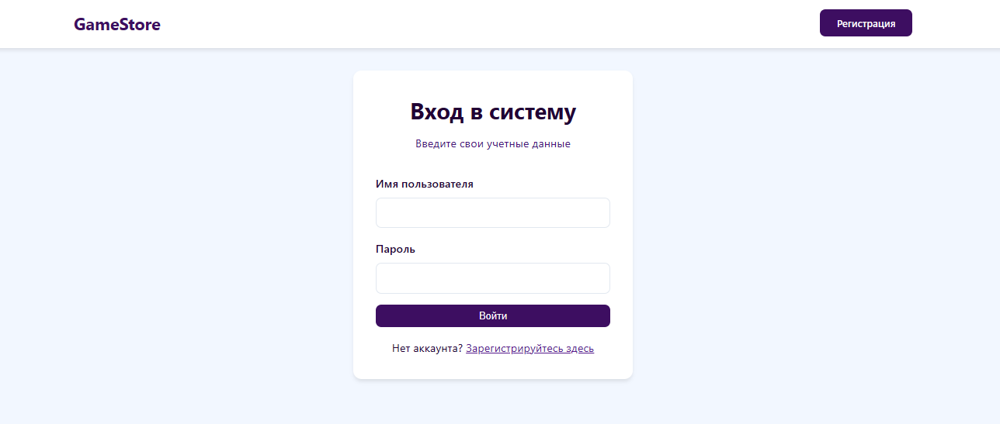
- **Просмотр каталога игр** с фильтрацией по категориям:
  
 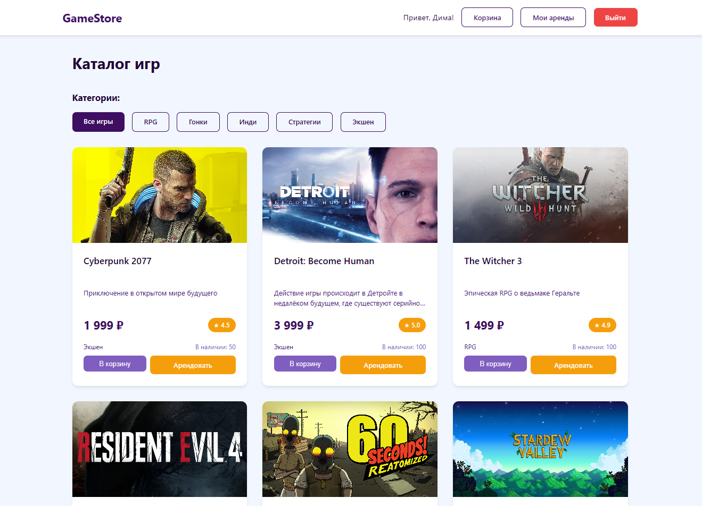
- **Детальная страница игры** с описанием, ценой и кнопками для покупки/аренды:
  
  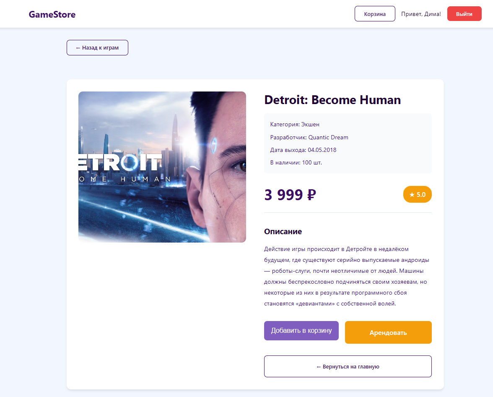
- **Корзина покупок** с возможностью добавления, удаления и изменения количества товаров:
  
 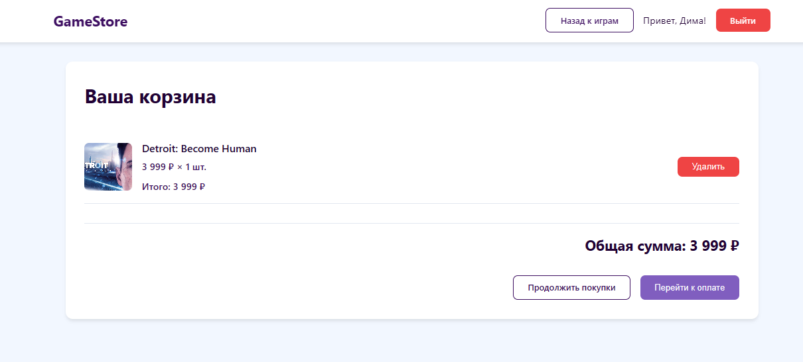
- **Аренда игр** с выбором даты начала и окончания:
  
  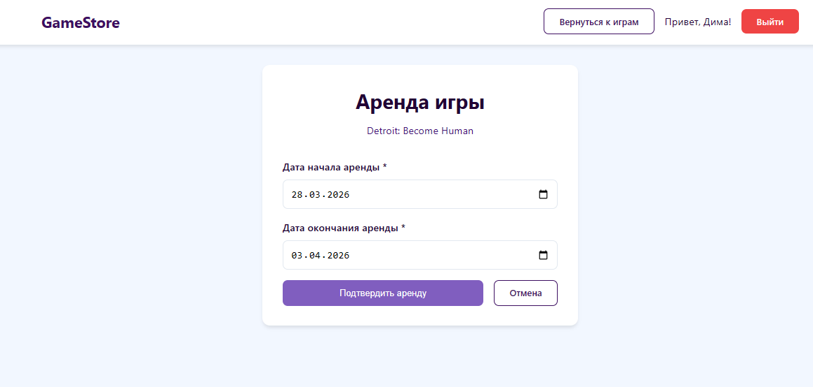
- **Личный кабинет** с историей активных и завершённых аренд:
  
 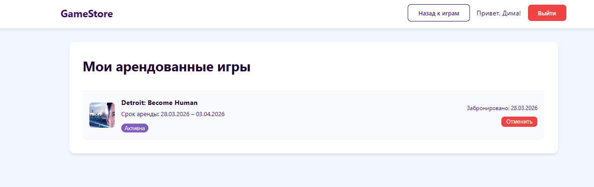
- **Отмена аренды** при необходимости:
  
 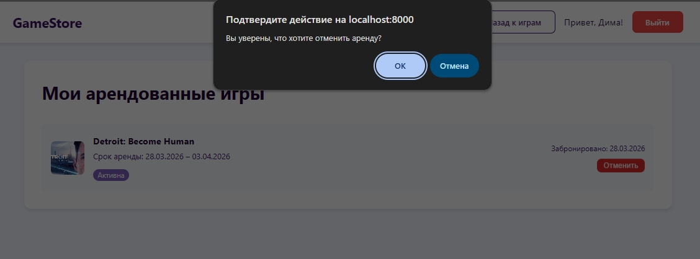

### Для администратора
- **Управление играми (CRUD):** добавление, редактирование, удаление карточек игр с загрузкой изображений:
  
  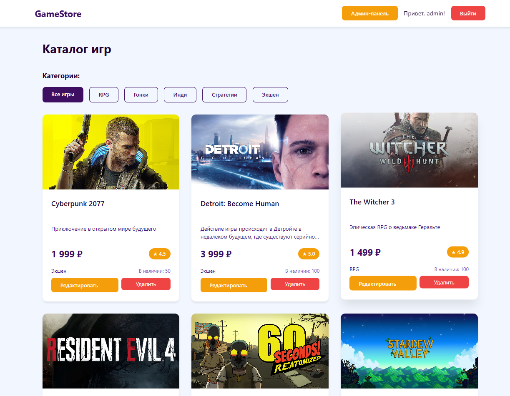
 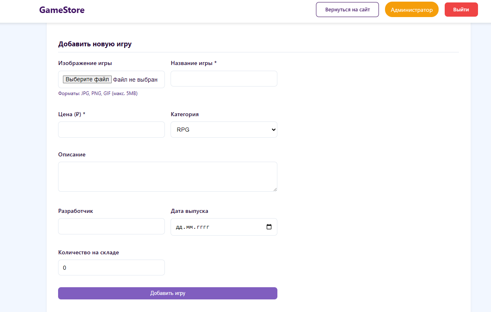
   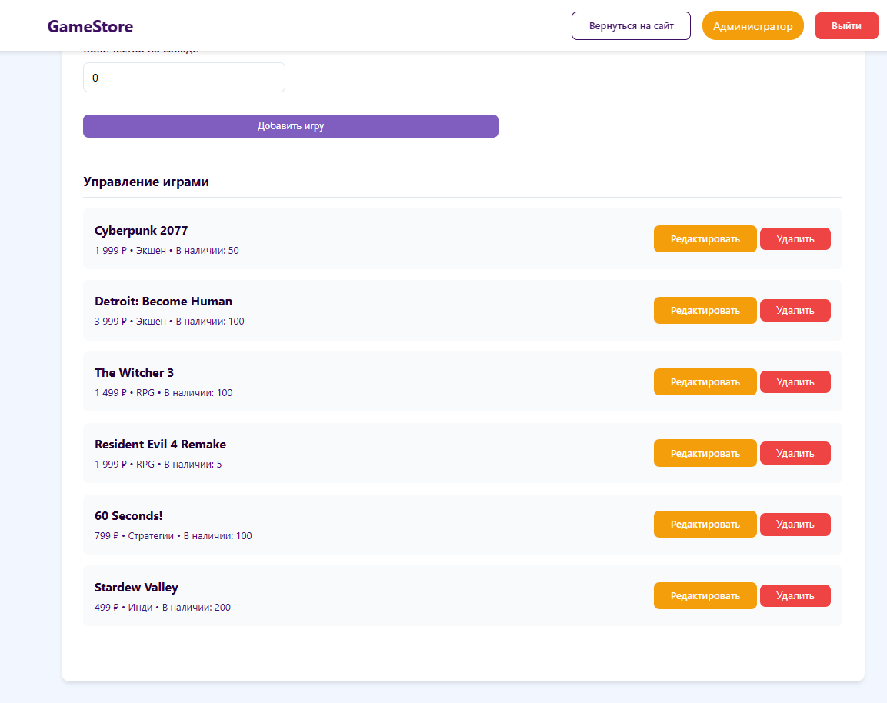
- **Управление пользователями:** просмотр всех пользователей и удаление обычных аккаунтов:
  
   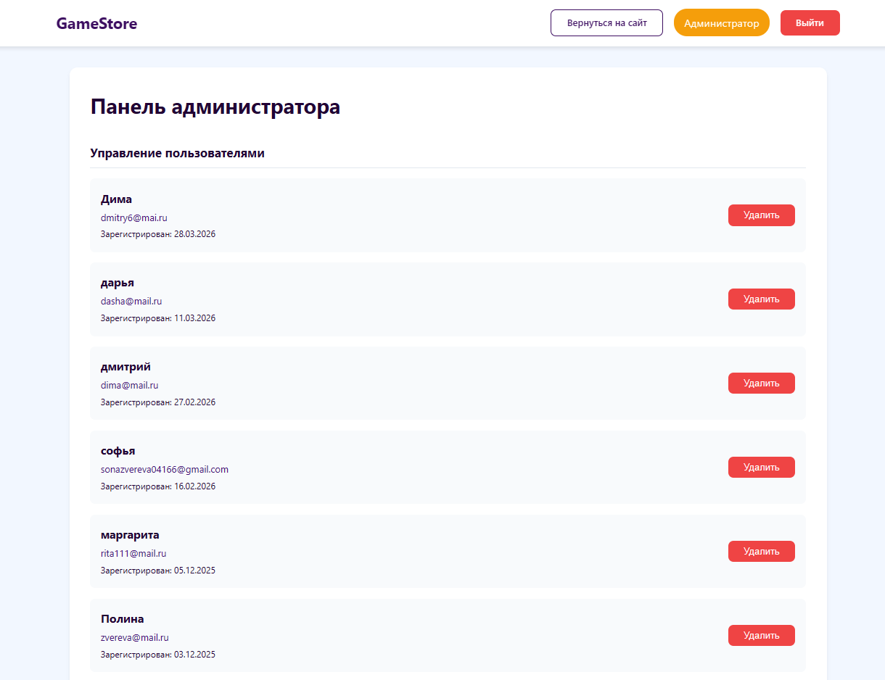

## Технологический стек

| Компонент       | Технология                      |
|-----------------|----------------------------------|
| Backend         | PHP (нативный, без фреймворков) |
| База данных     | PostgreSQL                       |
| Frontend        | HTML5, CSS3 |
| Сервер          | Apache (или любой совместимый)  |
| Работа с БД     | PDO (подготовленные выражения)  |
| Сессии          | PHP Native Sessions              |

## Структура базы данных

База данных `game_store` состоит из следующих основных таблиц:

- **users** — пользователи (id, username, email, password, role, created_at и др.)
- **categories** — категории игр (id, name)
- **games** — игры (id, title, description, price, category_id, image_url, stock и др.)
- **cart** — корзина (user_id, game_id, quantity) — составной первичный ключ
- **rentals** — аренда (id, user_id, game_id, start_date, end_date, status)

**Связи:**
- `users` ↔ `cart` (один-ко-многим)
- `games` ↔ `cart` (один-ко-многим)
- `categories` ↔ `games` (один-ко-многим)
- `users` ↔ `rentals` (один-ко-многим)
- `games` ↔ `rentals` (один-ко-многим)

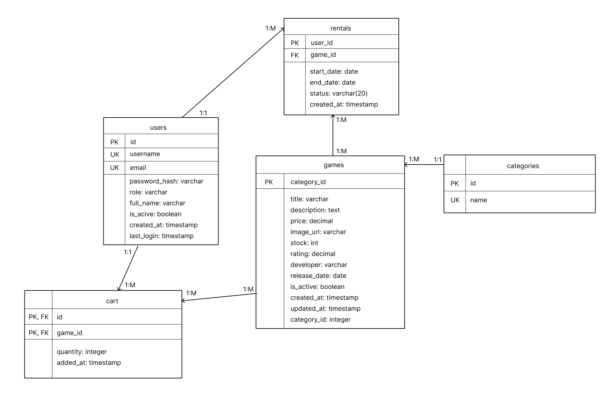

## Архитектура приложения

Приложение построено по классической **клиент-серверной архитектуре**.

## Тестирование

В ходе разработки было проведено функциональное тестирование всех ключевых модулей:

|Тестируемый модуль     | Результат                    |
|-----------------|----------------------------------|
| Регистрация         |  Корректная валидация, уникальность имени/почты |
| Авторизация	| Проверка пароля, перенаправление                       |
| Добавление в корзину	| Данные сохраняются в БД |
| Удаление из корзины	| Запись удаляется из БД  |
| Оформление аренды	| Запись создаётся в таблице rentals  |
| Добавление игры (админ)	| Игра появляется в каталоге и БД |
| Удаление пользователя	| Пользователь удаляется из БД|

## Перспективы развития
- Интеграция с платёжными системами (ЮKassa, Stripe);
- Система скидок и промокодов;
- Отзывы и рейтинги игр;
- Уведомления об окончании срока аренды;
- Статистика для администратора.

---

## Заключение

Разработанное веб-приложение GameStore представляет собой готовый прототип интернет-магазина с функционалом аренды. Оно отвечает современным требованиям безопасности, обладает интуитивно понятным интерфейсом и может служить основой для дальнейшего коммерческого развития.

